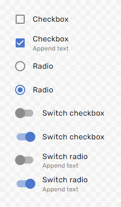

<div align="center">

<br>


<h1>zen-toggle</h1>

[](https://www.npmjs.com/package/zen-toggle)
[](https://github.com/ux-ui-pro/zen-toggle)

<p>
  <a href="https://ux-ui-pro.github.io/zen-toggle/dist/">Demo</a>
</p>

</div>

#### Hosting files
```HTML
<link rel="stylesheet" href="https://cdn.jsdelivr.net/npm/zen-toggle/dist/css/zen-toggle.min.css">
```
```HTML
<script src="https://cdn.jsdelivr.net/npm/zen-toggle/dist/js/zen-toggle.min.js"></script>
```

#### SCSS
```SCSS
@import "node_modules/zen-toggle/src/scss/zen-toggle";
```

#### JS
```javascript
import toggleHelper from "zen-toggle"
```

#### Set the base color (HSLA)
```CSS
.toggle {
    --color-base-h: 220;
    --color-base-s: 55%;
    --color-base-l: 55%;
    --color-base-a: 1;
}
```

<div align="center">

<br>



</div>

## License
zen-toggle is released under MIT license